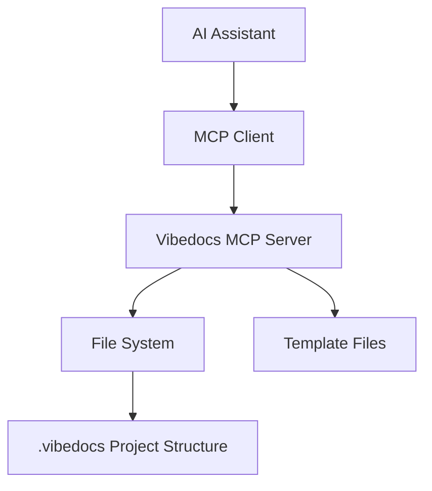

# Design Document

## Overview

The vibedocs MCP server is a Node.js application that implements the Model Context Protocol (MCP) to provide AI assistants with structured tools for managing vibedocs project workflows. The server exposes three primary tools (`vibedocs_start`, `vibedocs_create_release`, `vibedocs_close_release`) that enable AI assistants to guide vibecoders through disciplined project development from initial idea to versioned releases.

## Architecture

### Tech Stack
- **Runtime**: Node.js 18+ with TypeScript for type safety and developer experience
- **MCP Framework**: `@modelcontextprotocol/sdk` for MCP protocol implementation
- **File System**: Native Node.js `fs/promises` module for async file operations
- **Template Processing**: Simple string replacement for document template population
- **Validation**: JSON Schema validation for tool parameters
- **Package Management**: npm with standard Node.js project structure

### Architecture Pattern
The server follows a modular, stateless design:
- **Single Process**: One MCP server process handling all tool requests
- **Stateless Operations**: Each tool call is independent with no persistent state
- **File-Based Workflow**: All project state stored in filesystem structure
- **Template-Driven**: Document generation based on predefined templates
- **Error-First**: Comprehensive error handling with meaningful user feedback

### System Context


## Components and Interfaces

### 1. MCP Server Core (`src/server.ts`)
**Responsibility**: Main server initialization and MCP protocol handling
- Implements MCP server interface using `@modelcontextprotocol/sdk`
- Registers all available tools with proper schemas
- Handles tool invocation routing to appropriate handlers
- Manages server lifecycle and error handling

**Key Methods**:
- `initialize()`: Sets up MCP server and registers tools
- `handleToolCall(name, args)`: Routes tool calls to handlers
- `shutdown()`: Graceful server shutdown

### 2. Tool Handlers (`src/tools/`)
**Responsibility**: Individual tool implementation and business logic

#### VibedocsStartHandler (`src/tools/start.ts`)
- Validates project initialization requirements
- Creates `.vibedocs` folder structure
- Copies and populates discovery template
- Returns initialization status and next steps

#### VibedocsCreateReleaseHandler (`src/tools/create-release.ts`)
- Validates semantic version format
- Creates release folder structure
- Copies version templates (design.md, tasklist.md, retrospective.md)
- Updates project metadata with new release

#### VibedocsCloseReleaseHandler (`src/tools/close-release.ts`)
- Validates release exists and has required content
- Generates release notes summary
- Marks release as completed in metadata
- Returns closure confirmation and summary

### 3. File System Manager (`src/utils/filesystem.ts`)
**Responsibility**: File and directory operations with error handling
- `createDirectory(path)`: Creates directories with proper permissions
- `copyTemplate(source, destination, variables)`: Template copying with variable substitution
- `fileExists(path)`: Safe file existence checking
- `readFile(path)`: File reading with error handling
- `writeFile(path, content)`: File writing with error handling

### 4. Template Engine (`src/utils/templates.ts`)
**Responsibility**: Template processing and variable substitution
- `processTemplate(content, variables)`: Simple string replacement
- `loadTemplate(templatePath)`: Template file loading
- `validateTemplate(content)`: Template validation

### 5. Project Validator (`src/utils/validator.ts`)
**Responsibility**: Project state validation and consistency checks
- `isVibedocsProject(path)`: Validates project structure
- `validateVersion(version)`: Semantic version validation
- `checkReleaseExists(version)`: Release existence validation
- `validateProjectState()`: Overall project consistency

### 6. Schema Definitions (`src/schemas/`)
**Responsibility**: MCP tool parameter validation schemas
- JSON Schema definitions for each tool's parameters
- Input validation and error message generation
- Type safety for TypeScript interfaces

## Data Models

### Project Structure
```
.vibedocs/
├── project/
│   ├── plan/
│   │   ├── discovery.md
│   │   ├── prd.md
│   │   └── plan.md
│   └── work/
│       ├── feature-backlog.md
│       └── releases/
│           └── v[version]/
│               ├── design.md
│               ├── tasklist.md
│               └── retrospective.md
└── .templates/
    ├── plan/
    └── work/
```

### Tool Schemas

#### vibedocs_start
```typescript
interface StartParams {
  projectIdea?: string;  // Optional initial project description
  workingDirectory?: string;  // Optional working directory path
}

interface StartResponse {
  success: boolean;
  message: string;
  projectPath: string;
  nextSteps: string[];
  createdFiles: string[];
}
```

#### vibedocs_create_release
```typescript
interface CreateReleaseParams {
  version: string;  // Semantic version (e.g., "0.1.0")
  description?: string;  // Optional release description
}

interface CreateReleaseResponse {
  success: boolean;
  message: string;
  releasePath: string;
  version: string;
  createdFiles: string[];
}
```

#### vibedocs_close_release
```typescript
interface CloseReleaseParams {
  version: string;  // Version to close
  releaseNotes?: string;  // Optional release notes
}

interface CloseReleaseResponse {
  success: boolean;
  message: string;
  version: string;
  summary: string;
  completedTasks: number;
}
```

### Project Metadata
```typescript
interface ProjectMetadata {
  name: string;
  created: string;
  currentPhase: 'discovery' | 'planning' | 'development';
  releases: {
    [version: string]: {
      status: 'active' | 'completed';
      created: string;
      completed?: string;
    };
  };
}
```

## Error Handling

### Error Categories
1. **Validation Errors**: Invalid parameters, malformed versions
2. **File System Errors**: Permission issues, disk space, missing templates
3. **Project State Errors**: Invalid workflow state, missing prerequisites
4. **MCP Protocol Errors**: Communication issues, malformed requests

### Error Response Format
```typescript
interface ErrorResponse {
  success: false;
  error: {
    code: string;
    message: string;
    details?: any;
    suggestions?: string[];
  };
}
```

### Error Handling Strategy
- **Graceful Degradation**: Provide fallback templates if originals are missing
- **Clear Messaging**: User-friendly error messages with actionable suggestions
- **Logging**: Comprehensive logging for debugging without exposing internals
- **Recovery Guidance**: Suggest corrective actions for common error scenarios

## Testing Strategy

### Unit Testing
- **Tool Handlers**: Test each tool's business logic independently
- **File System Operations**: Mock filesystem for reliable testing
- **Template Processing**: Test variable substitution and edge cases
- **Validation Logic**: Test all validation rules and error conditions

### Integration Testing
- **MCP Protocol**: Test full MCP request/response cycles
- **File System Integration**: Test actual file operations in isolated environments
- **Workflow Scenarios**: Test complete user workflows end-to-end
- **Error Scenarios**: Test error handling and recovery paths

### Test Structure
```
tests/
├── unit/
│   ├── tools/
│   ├── utils/
│   └── schemas/
├── integration/
│   ├── mcp-protocol/
│   ├── filesystem/
│   └── workflows/
└── fixtures/
    ├── templates/
    └── projects/
```

### Testing Tools
- **Jest**: Primary testing framework
- **Supertest**: MCP server testing
- **Mock-fs**: File system mocking
- **TypeScript**: Type checking in tests

### Performance Testing
- **Response Time**: Ensure < 2 second response times for file operations
- **Memory Usage**: Monitor memory consumption during template processing
- **Concurrent Requests**: Test multiple simultaneous tool calls
- **Large Projects**: Test with projects containing many releases

### Quality Gates
- **Code Coverage**: Minimum 80% coverage for all modules
- **Type Safety**: Zero TypeScript errors
- **Linting**: ESLint compliance with strict rules
- **Security**: No known vulnerabilities in dependencies