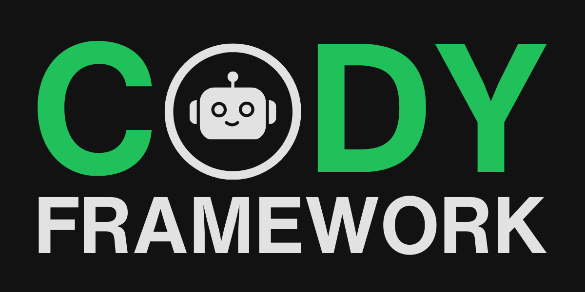

# Cody Spec Driven Development Framework



© Copyright 2025 - Red Pill Blue Pill Studios, LLC - All Rights Reseved.


[](LICENSE.md)

# Join our Discord Server
Get the latest updates, news and more by [joining our Discord server](https://discord.gg/Mz7vdRmpJH).

# Star our repo!
If you like this project, please don't forget to give it a star above!  Thank you!

# About Cody SDD Framework
Say hello to Cody, a spec-driven development framework built specifically to help Vibe Coders bring their ideas to life. Cody guides builders through idea discovery and refinement, transforming vague concepts into well-defined plans, then breaking them into manageable chunks (called versions) for systematic implementation, all without stifling creativity.

## What's the Cody SDD Framework? 
Cody (previously known as Vibedocs) is a spec driven development framework designed for Claude Code, Codex, Gemini CLI, OpenCode, Cursor, Copilot, and other AI coding environments. It guides you through:

- Idea Discovery and Refinement: Capture sparks of inspiration and shape them into clear, actionable plans.
- Planning: Organize your thoughts into structured, yet flexible, documents that keep creativity alive.
- Chunked Implementation: Break projects into manageable chunks, called versions, you can build, test, and iterate on.

With Cody, you get:

- A consistent structure that keeps documentation, planning, and implementation in sync.
- Faster progress by eliminating repetitive guesswork and freeing your focus for creativity.
- Better collaboration as everyone (you, your team and AI) works from the same rhythm of tasks, milestones, and shared understanding.

## Built for Vibe Coders and the New Generation of Builders

- Scaffolding: Cody provides templates and guidance.
- Agent-friendly Flexibility: You stay in control; Cody simply sets the path.
- AI-first Integration: Cody works directly where your coding assistant lives.
- Consistency at Scale: Solo or team, Cody keeps docs, plans, and versions aligned.

## Core Philosophy

Cody bridges the gap between unstructured brainstorming and systematic development:

- Structure Without Rigidity: Guidance that supports, not restricts.
- Iterative Refinement: Built-in feedback loops between human and AI.
- Version-based Development: Work is organized into clear, manageable chunks, called versions.
- Living Documentation: Project docs that evolve as your work evolves. Constantly updated.

# Cody's Two-Phase Development Cycle

## Phase 1: Plan
Transform raw ideas into actionable plans through three key documents:

### Discovery Document (`discovery.md`)
> The Discovery Document captures the raw, unfiltered initial idea and begins with an interactive Q&A between the builder and the AI Agent to refine understanding. The outcome of this process is a clear project vision and a set of requirements that serve as the foundation for moving forward.

### Product Requirements Document (`prd.md`)
> The Product Requirements Document formalizes "the what and the why" of your product by providing a structured definition that guides development. It includes sections such as the summary, goals, target users, key features, success criteria, user stories, assumptions, and dependencies. Together, these components ensure that the product vision is clearly articulated and aligned with stakeholder needs.

### Implementation Plan (`plan.md`)
> The Implementation Plan defines "how and when" the product will be built by laying out a clear technical roadmap and implementation strategy. It covers critical sections such as the architecture, components, data model, technical steps, tools and services, risks, milestones, and environment setup. Together, these details provide a structured guide for building and delivering the product efficiently and effectively.

## Phase 2: Build
The build phase breaks development into manageable versions:

### Feature Backlog (`feature-backlog.md`)
> The Feature Backlog serves as the central repository of all features derived from the implementation plan. Each feature is organized into versions with priority and status tracking to ensure clarity and progress visibility. Status types include 🔴 Not Started, 🟡 In Progress, and 🟢 Completed, while priority levels are categorized as High, Medium, or Low. This structure provides a clear, organized view of upcoming, active, and completed work.

### Version Documents (per version)
Each version includes:

### Design Document (`design.md`)
> The Design Document provides the technical implementation guide for the version, offering an overview of the architecture along with detailed implementation notes. It also highlights open questions and considerations, ensuring that potential challenges are identified early and addressed as part of the development process.

### Task List (`tasklist.md`)
> The Task List provides a detailed breakdown of work organized by phases, ensuring clarity around what needs to be accomplished at each stage. It is populated directly from the Feature Backlog, translating planned features into actionable development tasks. The list supports task tracking with status and priority, making it easy to monitor progress and address blockers while ensuring that every task contributes to the delivery of defined features.

### Retrospective (`retrospective.md`)
> The Retrospective is a post-version reflection document that captures the lessons learned throughout the development cycle. It highlights what worked well, identifies areas that could be improved, and records actionable items to guide and enhance future versions. This document benefits not only the human builder but, more importantly, the AI Development Agent, as it provides structured feedback that helps refine future interactions, improve decision-making, and optimize the overall development process.

### Release Notes (`release-notes.md`)
> The Release Notes document provides automatic release notes generation and management throughout the build lifecycle. It tracks all versions, key features, enhancements, bug fixes, and other notable changes. This document is created and updated automatically after each version build and during global project updates, ensuring stakeholders and team members have a clear, up-to-date record of all project changes.

## Version Naming Convention

The Cody Framework uses semantic versioning with descriptive names:
- **Format**: `v[major.minor.patch]-[name]`
- **Example**: `v1.0.3-refactor-code`
- **Rules**:
  - Starting version: `v0.1.0` (unless specified)
  - Names:  Names can't be longer than 30 characters in total.  Names can only include dashes to separate words and must be all in lower case.  Only allow letters (lower case), numbers (0-9) and '-' (dashes) to separate words.
  - Auto-increment unless user specifies version.
  - [name] is optional.

## Command Reference
You can tell Cody what to do using the `:cody [command]` format.

| Command | Description |
|---------|-------------|
| `:cody help` | Provides the USER with help about Cody. |
| `:cody plan` | Creates a Cody project and starts the PLAN phase. |
| `:cody build` | Starts the BUILD phase and creates the feature backlog. |
| `:cody version build` | Begins the building phase of a particular version in `feature-backlog.md` file. Automatically creates or updates `release-notes.md` when the version is completed. |
| `:cody version add` | Adds a new version to the `feature-backlog.md` file. |
| `:cody refresh` | Refreshes the AI AGENT's memory about the current. |
| `:cody refresh update` | Refreshes the AI AGENT's memory about the current and the AI AGENT updates the `plan.md`, `prd.md`, and `release-notes.md` files with the latest project changes. |
| `:cody relearn` | It forces the AI AGENT to re-read the Cody `agent.md` file to check for any updates |
| `:cody upgrade` | Upgrades the Cody framework to the latest version from GitHub |
| `:cody assets list` | Lists all the files stored in the assets folder, along with a description of what they are used for |

## File Structure

```
.claude/
└── commands/
    └── cody.md                    # Claude Code slash command integration

.cody/
├── config/
│   ├── activate.md          	# Cody Framework activation instructions
│   ├── agent.md             	# AI agent instructions
│   ├── settings.json           # Cody configuration
│   ├── commands/               # Command definitions
│   │   ├── assets-list.md
│   │   ├── build.md
│   │   ├── help.md
│   │   ├── plan.md
│   │   ├── refresh-update.md
│   │   ├── refresh.md
│   │   ├── relearn.md
│   │   ├── upgrade.md
│   │   ├── add-version.md
│   │   └── build-version.md
│   ├── scripts/                # Utility scripts
│   │   ├── upgrade-check.sh
│   │   ├── upgrade-download.sh
│   │   └── upgrade-install.sh
│   └── templates/
│       ├── plan/               # Planning phase templates
│       │   ├── discovery.md
│       │   ├── prd.md
│       │   └── plan.md
│       └── build/              # Build phase templates
│           ├── feature-backlog.md
│           ├── release-notes.md
│           └── version/
│               ├── design.md
│               ├── tasklist.md
│               └── retrospective.md
└── project/
  ├── library/
  │   ├── assets/                  # Any assets for the User or AI.
  │   ├── docs/                    # On-Demand or Ad-hoc documentation.
  ├── plan/                        # Documents created during the plan phase.
  │   ├── discovery.md
  │   ├── prd.md
  │   └── plan.md
  └── build/                       # Documents created during the build phase.
    ├── feature-backlog.md
    ├── release-notes.md
    └── v[x.y.z]-[name]/
      ├── design.md
      ├── tasklist.md
      └── retrospective.md

.github/
└── prompts/
    └── cody.prompt.md             # GitHub Copilot prompt integration
```

## Best Practices

### For Planning Phase
> In the planning phase, be thorough in discovery since the Q&A sets the direction and de-risks assumptions. Iterate on your documents and do not rush; refine each section until it clearly reflects the intent. Think modularly by breaking complex ideas into manageable components that can be built, tested, and reused. Finally, consider dependencies early by identifying external requirements and integrations upfront so timelines and scope remain realistic.

### For Build Phase
> During the build phase, start small by delivering foundational features in the early versions to create momentum and validate the direction. Maintain the backlog consistently, updating it as requirements evolve to keep priorities clear and aligned. Incorporate regular retrospectives to reflect on what worked, what didn't, and how to improve in the next cycle. Version strategically by grouping related features into logical sets, ensuring that each release delivers cohesive value while keeping the development process organized. Keep release notes current by letting the AI automatically update them after each version build, and review them periodically to ensure accuracy and completeness.

### For AI Collaboration
> When collaborating with AI, always provide context, the more detail captured during discovery, the more effective the AI’s assistance will be. Treat generated content as a draft, reviewing and refining it to ensure accuracy and alignment with your vision. Ask questions freely, using the AI to explore edge cases and uncover considerations you may not have thought of. Embrace iteration, as the process is designed for multiple rounds of refinement that gradually sharpen both the output and the overall direction.

## Troubleshooting

### Common Issues
- **Stuck in planning**: Set time limits for each document iteration
- **Overwhelming backlog**: Focus on next 2-3 versions, keep others high-level
- **Version scope creep**: Use the design document to maintain focus
- **Skipping retrospectives**: These are crucial for continuous improvement

### Getting Unstuck
- Return to the discovery document to reconnect with core vision
- Break large features into smaller, more manageable pieces
- Use the AI agent to explore alternative approaches
- Review successful past versions for patterns to repeat
 
## Installing and Using Cody

The Cody Framework can be easily added to any project by following these steps:

### Installing It
1. **Download Cody**: Clone or download Cody from https://github.com/icodewith-ai/cody-framework
2. **Install Cody**: Copy the `.cody`, `.claude`, and `.github` folders into your project's root directory

### Activating It
- **For Claude Code**: Use the `/cody` slash command
- **For GitHub Copilot**: Use the `/cody` slash command
- **For other AI assistants**: Ask your AI assistant to "Please read and execute the @.cody/config/activate.md"

### Using It
Once activated, you can use these commands with your AI assistant to kick start the process:
- **`:cody help`**: Displays all available commands and how to use them.
- **`:cody plan`**: Starts the planning phase, creating necessary documents and guiding you through the discovery process.

Cody works with any Agent Development Environment (Claude Code, Codex, OpenCode, etc) that has built in tools for file management.

## License

This project is licensed under a custom license. See the [LICENSE.md](LICENSE.md) file for details.